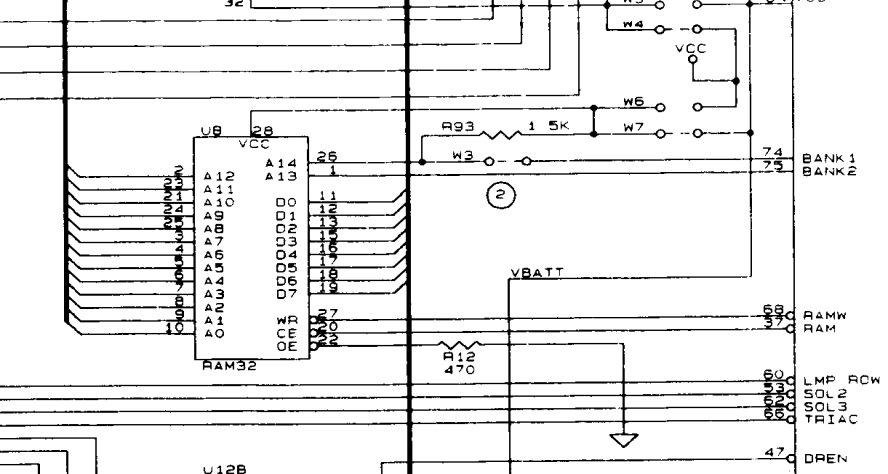

# pinball high scores

[inspiration](http://spritesmods.com/?art=twitter1943)

## plan

* the ds2064 is socketed, so make a [breakout board](ram-fpga) that passes through the connections. 
* add an FPGA that can listen to the 13 address lines, the 8 data lines and the 3 read/write/select pins = 24pins.
* when in write mode, with address in the high score range the FPGA reads the data off the bus.
* write [ds2064 driver](hdl/sram_driver/README.md)

# Resources

http://www.pinballsupernova.com/Williams%20Repair%20Guide/Williams%201990-1999%20WPC.pdf
page 20 ram details

emulator https://github.com/neophob/wpc-emu
http://bcd.github.io/freewpc/The-WPC-Hardware.html#The-WPC-Hardware

The CPU board contains the main processor: a Motorola 68B09E, running at 2Mhz. It is an 8-bit/16-bit CPU with a 64KB address space. Bank switching is required to address more than 64KB. On reset, location 0xFFFE is read to determine the address of the first instruction.

8KB of RAM is located at physical address 0x0000. When power is turned off, three AA batteries on the CPU board maintain the state of the RAM. 

## WPC89

fairly sure this is the main board on my doctor who pinball.
[good overview here](http://level42.ca/files/PinRepair/System%20WPC/WPC%20part1/index1.htm)

It uses a battery backed up [ds2064](docs/ds2064.pdf) to store audits and score I hope.

[Schematic](docs/wpc89.pdf)

# Available machines to try

## bride

https://www.ipdb.org/machine.cgi?gid=1502
williams wpc

## high speed

https://www.ipdb.org/machine.cgi?id=1176
Williams System 11

## grand lizard

https://www.ipdb.org/machine.cgi?id=1070
williams system 11

## fire power 

https://www.ipdb.org/machine.cgi?id=856
williams system 6  (rottendog MPU327-4)
good photo: https://pinside.com/pinball/market/classifieds/archive/25465

## doctor who

https://www.ipdb.org/machine.cgi?id=738
williams wpc (fliptronics2)

